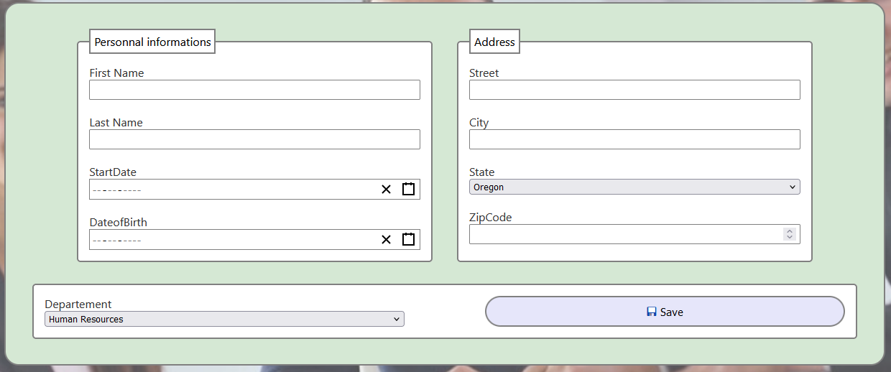

# HrNet

HrNet est une application interne utilisée par une entreprise pour gérer les dossiers et les données des employés.

## Installation

Pour installer le projet, suivez ces étapes :

1. Clonez le dépôt :
    ```sh
    git clone https://github.com/steflebelge/hrnet
    ```
2. Installez les dépendances :
    ```sh
    npm install
    ```
3. Démarrez l'application :
    ```sh
    npm start
    ```

## Utilisation

Une fois le projet installé et lancé, vous arriverez sur la page de création d'un employé. Ici, vous pouvez remplir le formulaire pour ajouter un employé à la base de données.

### Fonctionnalités

- **Ajout d'un employé** : Remplissez le formulaire sur la page de création d'un employé pour ajouter un nouvel employé à la base de données.
- **Gestion des employés** : Changez d'onglet pour accéder à la liste des employés déjà présents. Vous pouvez :
    - Trier la liste selon différents champs du tableau.
    - Filtrer la liste affichée via une valeur demandée.
    - Utiliser le système de pagination présent pour naviguer dans la liste.

## Dépendances

Cette application utilise le paquet npm 'simple-dropdown-library' en version 0.7.3.

## Prérequis

Ce projet nécessite un affichage minimal de 890*750 pixels pour s'afficher correctement.

## Contributeurs

- Gualandi Stefan

## Licence

Ce projet est open source.

## Captures d'écran



